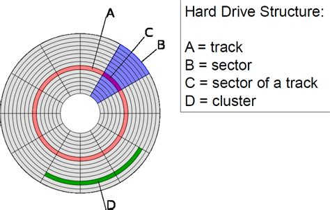

# B Trees and B+ Trees

Prerequisites

1. Disk Structure
1. How data is stored on disk
1. What is Indexing
1. What is multilevel Indexing
1. M-way Search Tree

## Disk Structure



Every track and sector on the disk has an index (serial number).

The area labeled `C (Sector of a track)` in the above image is also called a
**Block**. Every block has an address which is defined by it's track and sector
number.

> Block address = (Track Index, Sector Index)

For our study purpose let's say that every block size is 512 bytes.

A **512 byte** block:

```
[68 ][65 ][6c ][6c ][6f ][00 ] ... [00 ] // byte array of a block
  0    1    2    3    4    5   ...  511  // byte offsets
```

Each byte in a block has an address called **offset**.

## How data is stored on the disk

Let's say we've a data table **users:**

| column_id `(8 bytes)` | name `(10 bytes)` |
| --------------------- | ----------------- |
| 1                     | Alex Smith        |
| 2                     | Blex Smith        |
| 3                     | Clex Smith        |
| 4                     | Dlex Smith        |
| 5                     | Elex Smith        |
| ...                   | ...               |
| 100                   | Bla BlaBla        |

Each Record size is: `column_id + name = 8 + 10 = 18 bytes`
We've 100 records in our table so the whole size of our table
is `100 * 18 = 1800 bytes`. And
`1800 bytes = 1800 / 512 (our block size) = ceil(3.515) block = 4 blocks`.

## Indexing

Now when we'll need to find a record from this table with the `column_id`, we'll
have to scan this whole 4 blocks. This is inefficient. To reduce this search
time we can keep another table of all the `column_id`s of the **users** table
with a respective pointer pointing to the address of the record of that specific
`column_id`. This is called **indexing**.

| column_id `(8 bytes)` | pointer `(let's say 8 bytes)` |
| --------------------- | ----------------------------- |
| 1                     | \*pointer\*                   |
| 2                     | \*pointer\*                   |
| 3                     | \*pointer\*                   |
| 4                     | \*pointer\*                   |
| 5                     | \*pointer\*                   |
| ...                   | \*pointer\*                   |
| 100                   | \*pointer\*                   |

Now this table also have to be stored on the disk. It's size will be:
`100 * (8 + 8) = 1600 bytes` which is
`1600 / 512 (block size) = ceil(3.125) blocks = 4 blocks`

## Multilevel Indexing

Now as we've indexing we can search records quickly without scanning the whole
table. But what happens if number of records in our table grows and as a
consequence our index becomes a table of 1000 records?

> Index table size = `(16 * 10,000) / 512 = 313 blocks`

Now scanning the index is becoming inefficient itself. We can add another
layer of indexing on top of our original index to reduce the index search time.
But a pointer from the 2n index table will not point a single record in the 1st
index table rater it'll point to **a block address**.

Example of 2nd level index:

```
| column_id of first index (up to) | pointer to block |
| -------------------------------- | ---------------- |
| 32                               | *pointer*    ----|---> [Points to the 1st block of 1st level index table
| 64                               | *pointer*    ----|---> [Points to the 2nd block of 1st level index table
```

That way we can speed up our searching again. But what if the 2nd level grows
large too? Then we can more indexing levels on top of our 2nd indexing level.
And we want this index sizes to grow and shrink automatically according to our
database size. This is called **Multilevel Indexing.**

**Tip:** If we invert this index table relationships we get a tree like
structure, that's where the concept of **B Tree** comes in.

```
              [first level index]
              /       |         \
    [2nd lvl 1]   [2nd lvl 2]   [2nd lvl 3]

              ... and so on ...
```

## M-way Search tree

In a `M-way` search tree every node has `M - 1` number of **keys** and `M`
number of **children**. In every node of a M-Way search tree
`key(1) < key(2) < ... key(n - 1) < key(n)`

So a binary search tree is a `2 - way` search tree.

### `3 - way` search tree

```
                [20   50]
               /    |   \
              /     |    \
             /      |     \
        [10 15]  [30 35] [60 90]
         ...       ...      ...
```

### Using a 4-way search tree for multilevel indexing

A node of a 4-way search tree

```
+-------+-------+-------+-------+-------+-------+-------+-------+-------+-------+
|child 1|KEY 1  |rec p 1|child 2| KEY 2 |rec p 2|child 3| KEY 3 |rec p 3|child 4|
+-------+-------+-------+-------+-------+-------+-------+-------+-------+-------+
```

Each `rec p` (Record Pointer) points to a table of the first level index.

## B trees

B trees are nothing but m-way search trees but with some added **rules**.

### Rules

1. Every node must be filled half (`ceil(m / 2)`) before creating a new child
   node.
1. The **Root** can have **minimum two** children.
1. All leaf nodes must be at the same level.
1. The creation process must be bottom up.
