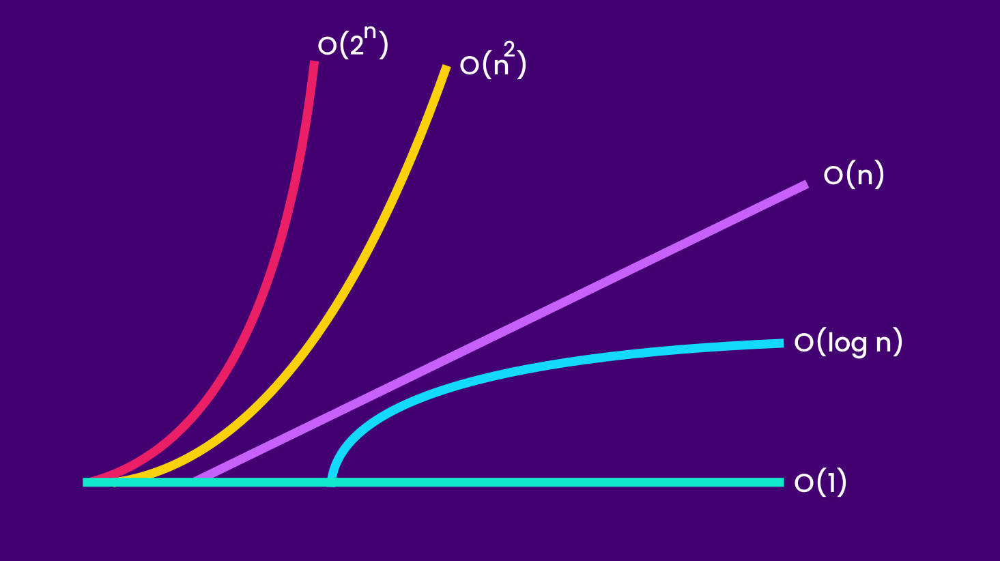

What is Big O?
----

__Wikipedia:__ Big O notation is a mathematical notation that describes the
limiting behavior of a function when the argument tends towards a particular
value or infinity.

We use Big O to describe the performance of an algorithm.

__Big O notation:__ `O(n)`

O(1) - Constant
---

When a method always performs an exact amount of task and in constant time
regardless of it's input size, we that it's runtime complexity is `O(1)`.

```ts
function printFirstItem(arr: number[]) {
  // O(1)
  console.log(arr[0]);
}
```

The runtime complexity of the `printFirstItem` function above is `O(1)` because
no matter how large the array is, it will always execute in constant time. 

O(n) - Linear
---

The cost of an algorithm grows __linearly__ with direct corelation of it's input
size we say it's runtime complexity is `O(n)`. Here `n` represents the size of
the input.

```ts
function print(array: number[]) {
  // O(n)
  for (const item of array) console.log(item);
}
```

O(n<sup>2</sup>) - Quadratic
----

```ts
function print(array: number[]) {
  // O(n * n + n) = O(n^2 + n) ≍ O(n ^ 2)
  for (const first of array) // O(n)
    for (const second of array) // O(n)
      console.log(first, second);


  for (const third of array) // O(n)
    console.log(third);
}
```

O(log n) - Logarithmic
---

Sadly no example code snippet yet :(

An algorithm with logarithmic time complexity is better than `O(n)` or
`O(n ^ x)`. It's curve reaches an asymptote as the input grows.

Example: __Binary Search Algorithm.__

O(2<sup>n</sup>) - Exponential
---

`O(2 ^ n)` is the opposite of `O(log n)`. It becomes very slow very quickly as
ias it t input grows.

### Summary



Space Complexity
----

We also use the `O(x)` notation to express the space complexity of an algorithm.
We only count the __additional space__(excluding the space of the input) needed
to run an algorithm.
