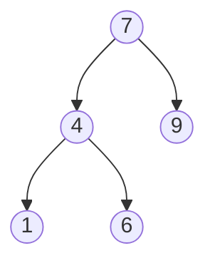

# Binary Trees

## What are Trees?

A tree is a data structure that stores elements in a hierarchy. We refer to
these elements as **nodes** and the lines that connects them as **edges**. Each
node contains a value or data. The top node is called the **root.** Any node
that doesn't have any children is called a **leaf node.**



**Binary Tree:** Is a DS where each node can have maximum of **two** children.

**Binary Search Tree:** A Binary Tree where the value of any node is always
greater than its left child and less than its right child (left < node < right).
It allows us to quickly lookup data.

**Usages:**

1. Represent hierarchical data
1. Database Indexes
1. Autocompletion
1. In Compilers (e.g., AST)
1. Compression (JPEG, MP3)

**Operations in Binary Search Tree:**

| Operation | Time Complexity |
| --------- | --------------- |
| Lookup    | O(log n)        |
| Insert    | O(log n)        |
| Delete    | O(log n)        |

## Tree Traversal

Tree traversal algorithms are separated into two categories.

1. **Breadth first (level order):** We visit all the nodes in the current level
   before moving to the next level.
1. **Depth first**
   1. Pre-order: **Root,** Left, Right
   1. In-order: Left, **Root,** Right
   1. Post-order: Left, Right **Root,** (we visit from the leaves to upward).

**Tip:** If we do an **in-order (left,root,right)** traversal of a binary search
tree then we'll visit all the nodes in ascending order. And if we reverse the
order (right, root, left) we get the nodes in descending order.

## Depth and Height of Nodes

1. **Depth:** The number of edges from the root node.
1. **Height:** Is the opposite of Depth. The height of a leaf node is **zero.** To
   calculate the height of a node, we need to find the longest path from that node
   to a leaf.The formula to calculate the height of a node using recursion: `1 + max(height(leftNode), height(rightNode))`

```
 height            8
   ^              / \
|  |             4   9
|  |            / \
V              2   3
depth         /
             1   <-- h: 0, d: 3
```
