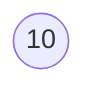
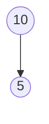
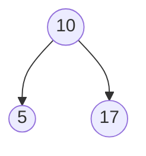
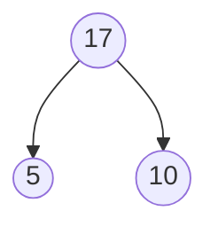
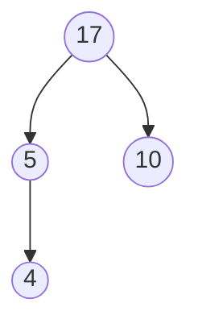
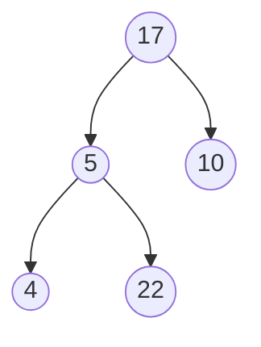
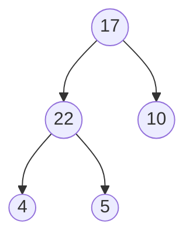
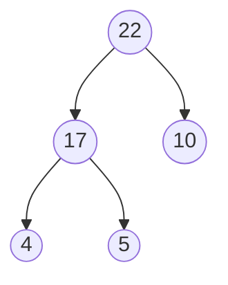

## 2 - What are Heaps

A heap is a special type of tree with two special properties:

1. It's a complete tree, meaning, every level except potentially the last level
   is completely filled and the levels are filled from the left to the right.

1. The value of every node is greater than or equal to it's children. This is
   called the heap property.

### Application of heaps

- Sorting data (HeapSort)
- Graph Algorithms (shortest path)
- Priority queues
- Finding the Kth smallest/largest value

### Populating a Heap

**Example:** Populating a heap.

```js
values = [10, 5, 17, 4, 22];
```

**Step: 1**



**Step: 2**



**Step: 3** Here `17` is violating the heap property. So we need to bubble it
up.



**Step: 4**



**Step: 5**



**Step: 6** Here `22` is violating the heap property so we need to bubble it up
until it satisfies the heap property.



**Step: 7** Bubble up `22`



**Step: 8** Bubble up `22`



### Operation Time complexity

| Operation | Time Complexity   |
| --------- | ----------------- |
| Insert    | O(LogN)           |
| Delete    | O(LogN)           |
| Max Value | O(1) for Max heap |
| Min Value | O(1) for Min heap |

## 4 - Building a Heap

As Heap is a complete binary search tree we implement it with arrays.

Heap nodes marked with their indices

```
                       0 [20]
                        /    \
                    1 [10] 2 [15]
                     /   \
                  3[4]  4[5]
```

### Formulas to calculate child indices

1. `left`: `parent_idx * 2 + 1`
1. `right`: `parent_idx * 2 + 2`
1. `parent`: `(index - 1) / 2`
