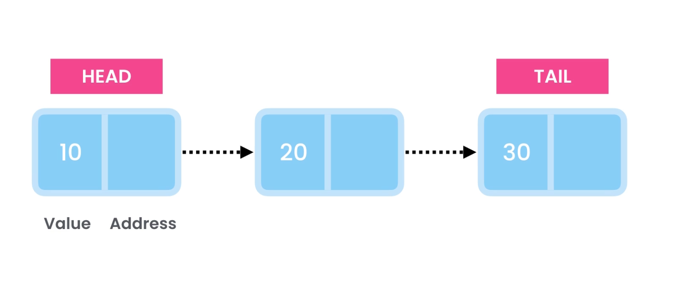

# Linked Lists

We use linked list to store a list of objects in sequence. Unlike arrays linked
lists can grow and shrink automatically.

Example of a **Singly** linked list:

A linked list consists of a groupe of nodes in sequence. Each node contains two
pieces of information:

1. A value
2. An address that points to the next node

## Time complexities of various operations

### Lookup:

1. by index: O(n)
1. by value: O(n)

### Insert:

1. At the end: O(1)
1. At the beginning: O(1)
1. In the middle: O(n)

### Delete

1. From the Beginning: O(1)
1. From the End: O(n)
1. From the Middle: O(n)
